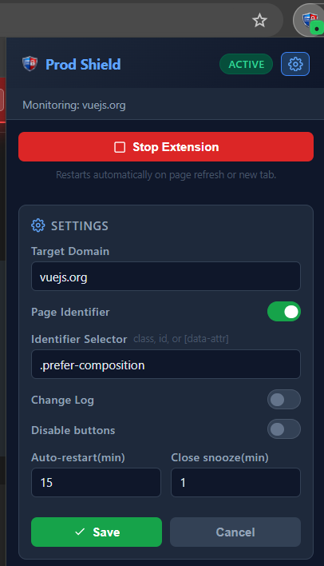
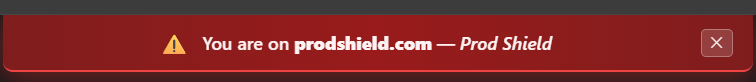

# Prod Shield

A Chrome / Firefox browser extension that protects you from accidental changes on production websites. It tracks form field edits, disables configured buttons, and shows a persistent warning banner whenever you are on the monitored domain.




---

## Table of Contents

- [Installation](#installation)
  - [Chrome](#chrome)
  - [Firefox](#firefox)
- [Quick Start](#quick-start)
- [Features](#features)
  - [Production Warning Banner](#production-warning-banner)
  - [Field Change Tracking](#field-change-tracking)
  - [Button Disabling](#button-disabling)
  - [Page Identifier](#page-identifier)
  - [Stop & Auto-Restart](#stop--auto-restart)
  - [Export Change Log](#export-change-log)
- [Settings Reference](#settings-reference)
- [Badge Indicators](#badge-indicators)
- [FAQ](#faq)

---

## Installation

### Chrome

1. Download or clone this repository to your local machine.
2. Open Chrome and navigate to `chrome://extensions`.
3. Enable **Developer mode** (toggle in the top-right corner).
4. Click **Load unpacked**.
5. Select the root folder of this repository (the one containing `manifest.json`).
6. The Prod Shield icon appears in your toolbar. Pin it for easy access.

### Firefox

1. Download or clone this repository to your local machine.
2. Open Firefox and navigate to `about:debugging#/runtime/this-firefox`.
3. Click **Load Temporary Add-on**.
4. Select the `manifest.json` file inside the repository folder.
5. The extension loads and stays active until Firefox is restarted.

> For a permanent Firefox installation, package the extension as a `.zip` and submit it to [addons.mozilla.org](https://addons.mozilla.org), or use a signed XPI.

---

## Quick Start

1. Click the Prod Shield icon in your toolbar to open the popup.
2. Click the **Settings** (gear) icon in the top-right of the popup.
3. Enter your production domain in the **Target Domain** field (e.g. `www.myapp.com`).
4. Click **Save** — the popup closes and settings are applied immediately.
5. Navigate to that domain — the red warning banner appears at the top of the page and the extension becomes active.

---

## Features

### Production Warning Banner

When you visit the monitored domain, a red banner appears fixed at the top of every page:

```
⚠️  You are on www.myapp.com — Prod Shield
```

The banner shows the actual hostname of the current page so you always know exactly which environment you are on.

- The banner reappears automatically every 30 seconds if it was closed, to ensure you never forget you are on production.
- Clicking **✕** snoozes the banner for the duration configured in **Close snooze (min)** (default: 1 minute). After the snooze expires the banner slides back in.
- The banner is removed instantly when the extension is stopped.

---

### Field Change Tracking

Prod Shield watches all form elements on the page for changes. This feature can be toggled on or off via the **Change Log** setting.

| Element type                                             | Tracked via                      |
| -------------------------------------------------------- | -------------------------------- |
| `<input>` (text, number, email, etc.)                    | `input` and `change` events      |
| `<textarea>`                                             | `input` and `change` events      |
| `<select>`                                               | `change` event                   |
| Toggle / switch (`role="switch"`)                        | click and keydown                |
| Checkbox / radio (native and ARIA)                       | click and keydown                |
| Combobox / listbox (`role="combobox"`, `role="listbox"`) | `aria-activedescendant` mutation |

When a field is changed from its original value it appears in the **Changed Fields** panel in the popup, showing:

- **Field label** — the accessible name of the field
- **Was** — the original value when the page loaded
- **Now** — the current value
- The **page URL path** and **timestamp** of the change

When the value is reverted back to its original the entry is removed automatically. The badge on the extension icon shows a live count of pending changes and blinks to draw attention.

> Enabling the **Change Log** toggle after making changes will immediately surface any fields that are currently different from their original values — you do not need to re-interact with them.

---

### Button Disabling

Prod Shield can disable specific buttons on the production page to prevent accidental saves or destructive actions.

- Buttons matched by your configured CSS selectors are disabled and shown at 50 % opacity with a "Disabled by Prod Shield" tooltip.
- Multiple selectors can be entered on separate lines, or as a comma-separated list on a single line — standard CSS selector syntax is supported.
- Buttons that were already disabled before the extension activated are left disabled when the extension stops (their original state is restored for all others).
- This feature can be toggled on or off in Settings without a page reload. The **Disable Button Selectors** field is only shown when this toggle is enabled.

---

### Page Identifier

By default, Prod Shield activates on every page of the monitored domain. The **Page Identifier** setting lets you restrict activation to specific pages by requiring a CSS element to be present.

- Enable the **Page Identifier** toggle in Settings and enter a CSS selector (class, ID, or data attribute), for example: `.admin-panel`, `#app-root`, `[data-env="prod"]`.
- The extension activates only when an element matching that selector exists on the page.
- Works with SPAs — if the element is added or removed dynamically, the extension starts or stops automatically without a page reload.

---

### Stop & Auto-Restart

**Stop Extension** — Click **Stop Extension** in the popup to immediately:

- Re-enable all buttons that Prod Shield disabled.
- Remove the warning banner.
- Stop tracking field changes.
- Schedule an automatic restart after the configured **Auto-restart** time.

> You cannot stop the extension while there are unsaved change logs. Export the PDF first, then stop.

**Auto-restart** — After the configured number of minutes the extension restarts automatically on the same tab, even if you navigated to a different page (as long as the new page is on the monitored domain).

**Restart Extension** — Click **Restart Extension** in the popup at any time to restart immediately without waiting for the timer.

When the extension is stopped the badge shows a ⏸ indicator. The auto-restart countdown is shown in the popup note.

---

### Export Change Log

When there are pending field changes the **Change logs** button appears next to the change count. Clicking it opens a formatted PDF-ready report in a new tab containing:

- Extension name and export timestamp
- A table of every changed field with label, original value, new value, page URL, and time of change

Print or save the page as a PDF from your browser's print dialog.

---

## Settings Reference

Open settings by clicking the **gear icon** in the top-right corner of the popup. Click **Save** to apply — the popup closes and changes take effect immediately across all open tabs on the monitored domain with no page reload required. Click **Cancel** to discard changes.

| Setting                      | Description                                                                                                                                 | Default        |
| ---------------------------- | ------------------------------------------------------------------------------------------------------------------------------------------- | -------------- |
| **Target Domain**            | The hostname to monitor. Subdomains are included automatically. Do not include the protocol (`https://`) or a trailing slash.               | `www.test.com` |
| **Page Identifier**          | Toggle to restrict activation to a specific page. When enabled, enter a CSS selector that must be present for the extension to activate.    | Off            |
| **Identifier Selector**      | CSS selector for the page element (class, ID, or data attribute). Only shown when Page Identifier is enabled.                               | _(empty)_      |
| **Change Log**               | Toggle whether Prod Shield tracks field changes and shows them in the Changed Fields panel.                                                 | On             |
| **Disable buttons**          | Toggle whether Prod Shield disables the buttons matched by your selectors.                                                                  | On             |
| **Disable Button Selectors** | CSS selectors (one per line, or comma-separated) for buttons to disable on the production page. Only shown when Disable buttons is enabled. | `.test-btn`    |
| **Auto-restart (min)**       | Minutes after stopping before the extension automatically restarts. Range: 1–1440.                                                          | `15`           |
| **Close snooze (min)**       | Minutes the banner stays hidden after clicking ✕. Range: 1–60.                                                                              | `1`            |

---

## Badge Indicators

| Badge                 | Meaning                                                 |
| --------------------- | ------------------------------------------------------- |
| Green **●**           | Extension is active on this tab                         |
| Grey **⏸**            | Extension is stopped; auto-restart pending              |
| Red number (blinking) | That many fields have been changed from their originals |
| _(empty)_             | Tab is not on the monitored domain                      |

---

## FAQ

**The banner is not appearing on my domain.**
Open Settings and confirm the Target Domain matches the hostname exactly (e.g. `app.mycompany.com`, not `https://app.mycompany.com/`). The domain field strips the protocol and trailing slash automatically when you save.

**The extension is not activating even though I am on the correct domain.**
If the **Page Identifier** is enabled, check that the configured selector matches an element on the current page. Open the browser DevTools console and run `document.querySelector("your-selector")` to verify.

**I can't click Stop Extension.**
If you have unsaved change log entries, the Stop button is intentionally disabled. Click **Change logs** to export the PDF, then stop.

**I enabled Change Log but no changes appear.**
Changes are tracked from the moment the toggle is enabled. If you already changed fields before enabling, Prod Shield will detect those diffs automatically when you save the setting. If you still see nothing, make sure the extension is Active (not Stopped) on the current tab.

**The extension stopped tracking after I navigated within the app.**
Prod Shield uses a MutationObserver to detect new form elements added by SPAs. If elements are missed, try clicking **Restart Extension** from the popup to re-scan the page.

**Does Prod Shield work on pages behind a login?**
Yes. The content script is injected into every page you visit; it activates only when the current URL matches your configured domain, regardless of authentication state.

**Can I monitor more than one domain?**
The current version supports a single target domain. To protect multiple domains, load separate instances of the extension with different configurations.
